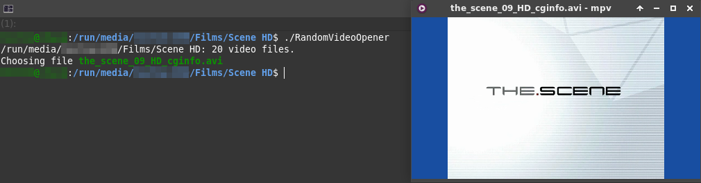

# RandomVideoOpener



__A simple program that opens a random video in the current directory__

[List of supported formats](src/files.cpp#L31)

_GNU/Linux and Windows are currently known to be supported_

## Build

### Release

The program outputs:
- current working directory
- number of files in the directory
- selected file number and name

GNU/Linux:

```
cd build

cmake .. -DCMAKE_BUILD_TYPE="Release"

make
```

Windows (with [MinGW](http://www.equation.com/servlet/equation.cmd?fa=fortran) and [CMake](https://cmake.org/download/#latest) installed):

```
cd build

cmake .. -DCMAKE_BUILD_TYPE="Release" -D"CMAKE_CXX_COMPILER=g++" -G "MinGW Makefiles" -D"CMAKE_MAKE_PROGRAM=make"

make
```

__The output binary will be named `RandomVideoOpener` or `RandomVideoOpener.exe`__

### Debug

The program outputs the same information as [Release](#release) and:
- check result for each file (VIDEO/NOT VIDEO)
- list of all files in the directory

GNU/Linux:

```
cd build

cmake .. -DCMAKE_BUILD_TYPE="Debug"

make
```

Windows (with [MinGW](http://www.equation.com/servlet/equation.cmd?fa=fortran) and [CMake](https://cmake.org/download/#latest) installed):

```
cd build

cmake .. -DCMAKE_BUILD_TYPE="Debug" -D"CMAKE_CXX_COMPILER=g++" -G "MinGW Makefiles" -D"CMAKE_MAKE_PROGRAM=make"

make
```
